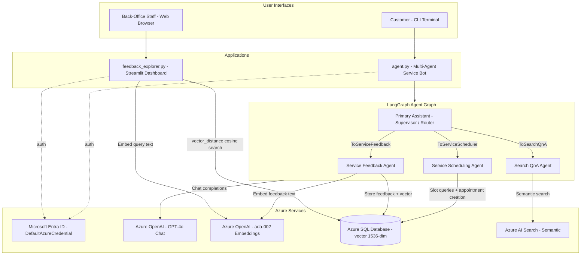
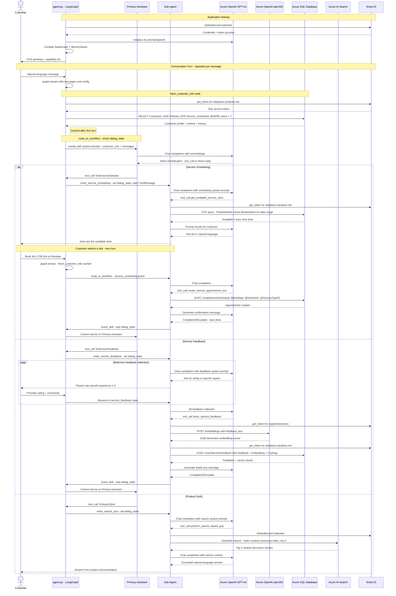
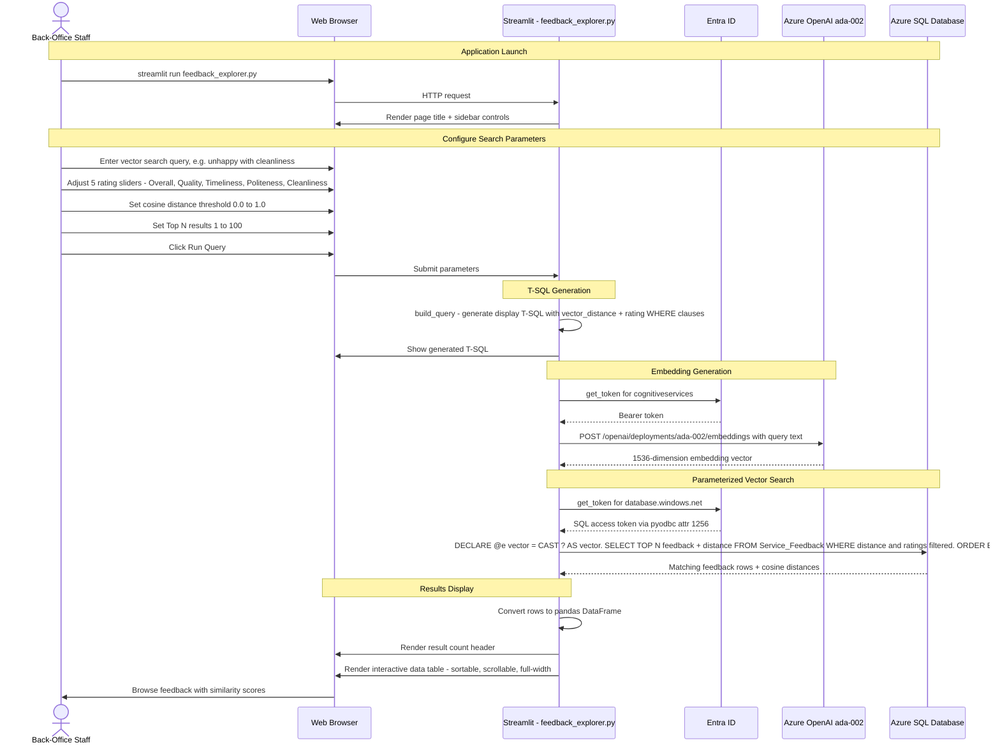

# Contoso Motocorp Service Bot

A multi-agent customer service assistant for a motorcycle dealership, built with [LangGraph](https://langchain-ai.github.io/langgraph/), Azure OpenAI, Azure SQL Database (with native vector support), and Azure AI Search.

The bot helps customers schedule vehicle service appointments, provide feedback on completed services, and get answers to product-related questions — all through natural conversation.

## Architecture

The application implements a **hierarchical multi-agent system** using LangGraph, adapted from the [LangGraph customer support tutorial](https://langchain-ai.github.io/langgraph/tutorials/customer-support/customer-support/#conversation). A primary supervisor agent routes conversations to specialized agents, each powered by its own LLM and system prompt:

| Agent | Purpose | Tools |
|---|---|---|
| **Primary Assistant** | Greets the user, understands intent, and delegates to the right specialist | Routes to sub-agents |
| **Service Scheduler** | Handles appointment booking and slot queries | `get_available_service_slots`, `create_service_appointment_slot` |
| **Service Feedback** | Captures post-service ratings and comments | `store_service_feedback` |
| **Search Q&A** | Answers product/vehicle questions using Azure AI Search | `perform_search_based_qna` |

Each agent can respond directly to the user without routing back through the supervisor, and can escalate back when the conversation context changes.


### System Overview

Both user-facing applications share the same Azure back-end services and authenticate exclusively through `DefaultAzureCredential` (no API keys or passwords).



### Customer-Facing Bot — Request / Response Flow

Each conversation turn flows through the LangGraph state graph. On the **first turn**, customer data is fetched from Azure SQL and cached in state; subsequent turns reuse the cache. The Primary Assistant classifies user intent via GPT-4o tool binding and delegates to the matching sub-agent. Sub-agents maintain multi-turn dialog via a `dialog_state` stack and a `MemorySaver` checkpointer keyed by `thread_id`.



### Back-Office Feedback Explorer — Request / Response Flow

The Streamlit dashboard converts a natural-language query into an embedding vector via Azure OpenAI, then runs a parameterized `vector_distance` cosine-similarity query against Azure SQL, combining semantic search with structured rating filters. The generated T-SQL is displayed alongside the results for transparency.



### Why an Integrated Vector Database Matters

The `Service_Feedback` table in Azure SQL Database stores **three kinds of data in a single row**:

| Column type | Examples | Purpose |
|---|---|---|
| **Structured ratings** | `rating_overall_experience`, `rating_quality_of_work`, `rating_timeliness`, `rating_politeness`, `rating_cleanliness` (integers 1–5) | Quantitative scoring, aggregation, filtering |
| **Free-form text** | `feedback_text` (nvarchar) | Verbatim customer comments |
| **Vector embedding** | `feedback_vector` (vector(1536)) | Semantic similarity search via `vector_distance('cosine', ...)` |

Because all three live in the same table, the Feedback Explorer can issue **a single T-SQL query** that:

1. **Semantically searches** free-form feedback text by comparing the query embedding against `feedback_vector` using cosine distance.
2. **Filters on structured ratings** (e.g., `rating_cleanliness <= 2`) using standard `WHERE` clauses.
3. **Joins, groups, and counts** across both dimensions — for example, counting how many low-cleanliness-rated feedbacks are semantically similar to "vehicle returned dirty."

In a traditional architecture this would require **multiple disparate systems** — a relational database for ratings, a separate vector store for embeddings, and an application layer to reconcile results across both. With Azure SQL's native vector support, the operational data, free-text feedback, and vector embeddings coexist in one engine, eliminating cross-system ETL, consistency issues, and reconciliation logic. One query, one transaction boundary, one source of truth.

## Project Structure

```
├── agent.py                     # Main multi-agent bot application
├── feedback_explorer.py         # Streamlit UI for interactive feedback analysis
├── requirements.txt             # Python dependencies
├── .env                         # Environment variables (not checked in)
├── .gitignore
├── documents/
│   ├── hf_100_aug_2024.pdf      # Hero Honda HF100 user manual (source)
│   └── heromotocorp-sample-understood.md  # Extracted & enriched content for search index
├── scripts/
│   ├── db-create.sql            # Database table creation & seed data
│   ├── create_service_schedule_sp.sql  # CreateServiceSchedule stored procedure
│   ├── capture-service-rating.sql      # InsertServiceFeedback stored procedure
│   ├── analyze_feedback_sp.sql         # AnalyzeFeedback stored procedure
│   ├── get_embeddings_sp.sql           # Embedding generation stored procedure
│   └── vector_feedback_search.py       # CLI vector search script
└── service_requests/
    ├── db_tools.py              # Database tools used by agents
    └── search_tools.py          # Azure AI Search tools used by agents
```

## Prerequisites

- Python 3.12+
- Azure subscription with:
  - **Azure OpenAI** (GPT-4o deployment + text-embedding-ada-002)
  - **Azure SQL Database** with [native vector support](https://learn.microsoft.com/azure/azure-sql/database/ai-artificial-intelligence-intelligent-applications?view=azuresql)
  - **Azure AI Search** (for product Q&A)
- ODBC Driver 18 for SQL Server
- Authentication via `DefaultAzureCredential` (Azure CLI, managed identity, etc.)

## Setup

1. **Clone the repository**:

    ```sh
    git clone <repository-url>
    cd Multi-Agentic-LangGraph-Integ-VectorDB-Sample
    ```

2. **Create and activate a virtual environment**:

    ```sh
    python -m venv .venv
    .venv\Scripts\Activate.ps1   # Windows PowerShell
    # or: source .venv/bin/activate  # macOS/Linux
    ```

3. **Install dependencies**:

    ```sh
    pip install -r requirements.txt
    ```

4. **Configure environment variables** — create a `.env` file in the project root:

    ```
    AZURE_OPENAI_ENDPOINT="https://<your-openai>.openai.azure.com/"
    AZURE_OPENAI_DEPLOYMENT_NAME="gpt-4o"
    AZURE_OPENAI_EMBEDDINGS_DEPLOYMENT_NAME="text-embedding-ada-002"
    API_VERSION="2023-08-01-preview"
    API_TYPE="azure"

    az_db_server="<your-server>.database.windows.net"
    az_db_database="<your-database>"

    ai_search_url="https://<your-search>.search.windows.net"
    ai_index_name="contoso-motocorp-index"
    ai_semantic_config="contoso-motocorp-config"
    ```

    > Authentication uses `DefaultAzureCredential` — no API keys or database passwords needed. Ensure your identity has the required RBAC roles on Azure OpenAI, Azure SQL, and Azure AI Search.

5. **Set up the database** — run the SQL scripts in order:

    1. `scripts/db-create.sql` — creates tables and inserts seed data
    2. `scripts/create_service_schedule_sp.sql` — creates the `CreateServiceSchedule` procedure
    3. `scripts/capture-service-rating.sql` — creates the `InsertServiceFeedback` procedure
    4. `scripts/analyze_feedback_sp.sql` — creates the `AnalyzeFeedback` procedure
    5. `scripts/get_embeddings_sp.sql` — creates the embedding generation procedure (**update the hardcoded Azure OpenAI endpoint URL** inside the procedure body to match your deployment)

6. **Set up Azure AI Search** — upload the contents of `documents/heromotocorp-sample-understood.md` to an Azure AI Search index named `contoso-motocorp-index` with a semantic configuration named `contoso-motocorp-config`.

## Usage

This project has two distinct applications for two different user personas:

---

### 1. Customer-Facing Service Bot

**Audience:** Customers interacting with Contoso Motocorp for vehicle services.

The multi-agent conversational bot allows customers to:
- Schedule vehicle service appointments
- Provide feedback and ratings on completed services
- Ask product and vehicle-related questions

**Launch:**

```sh
python agent.py
```

The bot greets the customer by name, introduces itself, and lists the available capabilities. Customers type their requests in natural language — the supervisor agent routes to the appropriate specialist agent automatically.

---

### 2. Back-Office Feedback Explorer

**Audience:** Back-office / operations staff analyzing customer sentiment and service quality.

A Streamlit-based interactive dashboard for exploring customer feedback stored in the Azure SQL vector database. Staff can combine semantic vector search with rating filters to identify trends, problem areas, and low-satisfaction patterns.

**Launch:**

```sh
streamlit run feedback_explorer.py
```

This opens a browser-based UI with:
- **Vector search** — enter a natural language sentiment query (e.g., "unhappy with cleanliness"), which gets embedded via Azure OpenAI and searched against the `feedback_vector` column using cosine distance
- **Rating sliders** — filter by max rating across 5 dimensions (overall experience, quality of work, timeliness, politeness, cleanliness)
- **Distance threshold** — control how similar results must be to the query
- **Generated T-SQL** — view the exact query being executed against Azure SQL
- **Results grid** — browse matching feedback in an interactive data table

---

### Additional CLI Tools

An alternative command-line script for feedback analysis — useful for scripting or quick one-off queries.

**Vector search with filters:**

```sh
python scripts/vector_feedback_search.py --query-text "poor service quality" --max-rating 3 --distance-threshold 0.5 --top 10
```
